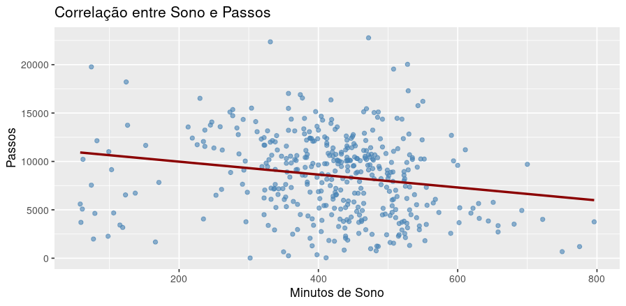

# 📊 Data Analytics Portfolio

Welcome to my data analytics project portfolio. This repository showcases real-world case studies where I apply the data analysis process using tools like R, SQL, and Python to generate business insights and actionable recommendations.

---
# Study Cases
## 🧠 Case Study 1: Bellabeat – How Can a Wellness Technology Company Play It Smart?

### Overview
Bellabeat is a high-tech manufacturer of health-focused products for women. In this case study, I analyze user behavior data collected via Fitbit to help Bellabeat understand how consumers use smart devices in their health routines — and how the company can make informed product and marketing decisions.

### Objective
Apply the data analysis process to answer the question:  
**"How can Bellabeat use smart device data to unlock new growth opportunities?"**

---

### 🧪 Analysis Process

| Phase     | Description |
|-----------|-------------|
| **Ask**       | Define the business task and objectives |
| **Prepare**   | Collect and inspect the Fitbit dataset |
| **Process**   | Clean and structure the data in R |
| **Analyze**   | Generate insights using statistical summaries and visualizations |
| **Share**     | Create a report and presentation with recommendations |
| **Act**       | Suggest data-driven strategies Bellabeat can apply |

---

### 📌 Key Insights

- **Average sleep**: 6.99 hours (below recommended)
- **High sleep efficiency**: 91.6%
- **Moderate correlation**: Steps ↔ Calories burned (0.59)
- **Negative correlation**: Sleep time ↔ Total steps (-0.19)
- **User engagement**: ~28.5 active days per user

### 🛠 Tools Used

- **R** – data cleaning, transformation, and analysis
- **Tidyverse** – for efficient data wrangling
- **ggplot2** – for creating visualizations
- **Reveal.js** – for slide presentation

---

## 📌 More Projects Coming Soon

This repository will grow with more case studies covering topics like:

- Customer segmentation
- Marketing funnel analysis
- Forecasting and time series
- SQL data exploration

Stay tuned!

---

## 🤝 Let’s Connect

Feel free to reach out or collaborate:

- [LinkedIn](https://www.linkedin.com/in/ehyodo/)
- [Email](Sheiti.hyodo@gmail.com)

